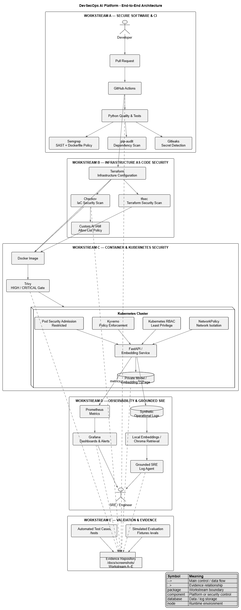

# Architecture — DevSecOps AI Platform

## 1. Purpose

The design protects a small AI-assisted microservice from the software change through infrastructure, cluster admission, runtime isolation and operational response. The challenge is simulated, so the architecture intentionally separates **real configuration** from **evidence that requires a live environment**.

## 2. Architecture diagram

## 3. Control mapping

| Layer | Control | Security objective | AI-specific reason |
|---|---|---|---|
| Source/CI | Semgrep | Detect insecure code and Dockerfile patterns early | Prevent insecure base-image and application patterns before an image exists |
| Dependencies | pip-audit | Detect known vulnerable packages | AI services often have large Python dependency trees; one vulnerable package can become an application entry point |
| Secrets | Gitleaks | Prevent credential leakage | LLM/provider keys can create both data-exfiltration and unexpected API-cost exposure |
| IaC | Checkov/tfsec | Prevent insecure cloud configuration | Model, embedding and telemetry data can be highly sensitive; storage exposure has a large blast radius |
| IAM | Custom Checkov allow-list | Prevent broad AI workload roles | A compromised inference identity should not become a subscription/resource-group administrator |
| Image | Trivy | Block known high/critical image CVEs | AI libraries frequently pull native/system packages; image vulnerabilities survive into runtime |
| Admission | PSA Restricted | Baseline pod hardening | Prevent root/privileged behavior that can turn an AI compromise into node compromise |
| Admission | Kyverno | Enforce non-root, resource limits and host isolation | AI inference/embedding jobs can consume large CPU/RAM/GPU resources unexpectedly |
| Runtime network | NetworkPolicy | Limit east-west communication | Compromised AI components should not freely reach databases, model stores or unrelated namespaces |
| Identity | Kubernetes RBAC | Minimize API access | The AI service only needs narrowly scoped Kubernetes API access, if any |
| Observability | Prometheus/Grafana | Detect degradation and security signals | Restart loops, latency spikes and policy denials can indicate both reliability and abuse |
| Log intelligence | Chroma + embeddings | Retrieve relevant operational evidence | Retrieval constrains the answer to available evidence and makes hallucination easier to detect |

## 4. What happens if a control is skipped?

### Semgrep is skipped
The PR can reach dependency/IaC checks with an insecure application or Dockerfile pattern. A `:latest` base image may still be caught later by image policy or vulnerability scanning, but the specific mutable-tag policy is no longer enforced at source.

### pip-audit is skipped
Known vulnerable Python packages can be packaged into the image. Trivy may detect OS/package vulnerabilities later, but it is not a replacement for Python package advisory scanning.

### Gitleaks is skipped
A provider key can reach source history, logs, build context or Terraform variables. Later infrastructure controls cannot reliably undo a secret that has already been committed; rotation is required.

### Checkov/tfsec is skipped
An unsafe storage or IAM configuration can pass all application-level tests. Cloud deployment then becomes the first point where the problem might be noticed.

### Trivy is skipped
A vulnerable application image can be promoted even when source and IaC controls pass.

### PSA/Kyverno is skipped
A developer can submit a root, privileged or unlimited-resource workload. For AI workloads, unlimited memory/CPU can cause noisy-neighbor impact or rapid capacity/cost growth.

### NetworkPolicy is skipped
A compromised AI pod can attempt lateral connections to unrelated services. Network segmentation does not replace identity controls, but it reduces the set of reachable targets.

### Prometheus/Grafana is skipped
Security and reliability signals become harder to correlate. The system may fail silently until users report an incident.

### SRE retrieval grounding is skipped
A free-form model could invent a cause that is not present in the logs. In incident response, an unsupported explanation can send responders toward the wrong remediation.

## 5. Data flows

1. Code enters the pull-request pipeline.
2. Fast, deterministic static checks run before image creation.
3. Terraform is checked independently of a live Azure subscription.
4. A container is built only after the source/IaC gates pass.
5. Trivy evaluates the built artifact for HIGH/CRITICAL vulnerabilities.
6. Kubernetes policy fixtures represent the admission controls applied to the workload.
7. The service emits metrics and operational logs.
8. Prometheus exposes operational/security metrics to Grafana.
9. Synthetic logs are embedded and stored locally for the SRE agent.
10. The agent retrieves evidence and produces an answer only from that evidence.

## 6. Production extensions

If this moved from a seven-day simulation to production, the next controls would include:

- GitHub OIDC to Azure instead of long-lived cloud credentials.
- Terraform remote-state locking and state access controls.
- Signed images with Cosign and admission verification.
- A real Kyverno policy set tested against the cluster's exact Kubernetes version.
- A CNI enforcing NetworkPolicy, plus default-deny egress where appropriate.
- Loki/OpenTelemetry log ingestion with retention and access controls.
- Real Kubernetes/CI metrics and SLO-based alerting.
- Authentication and authorization for the SRE agent.
- Rate limiting, audit logging and cost controls for any future LLM calls.
